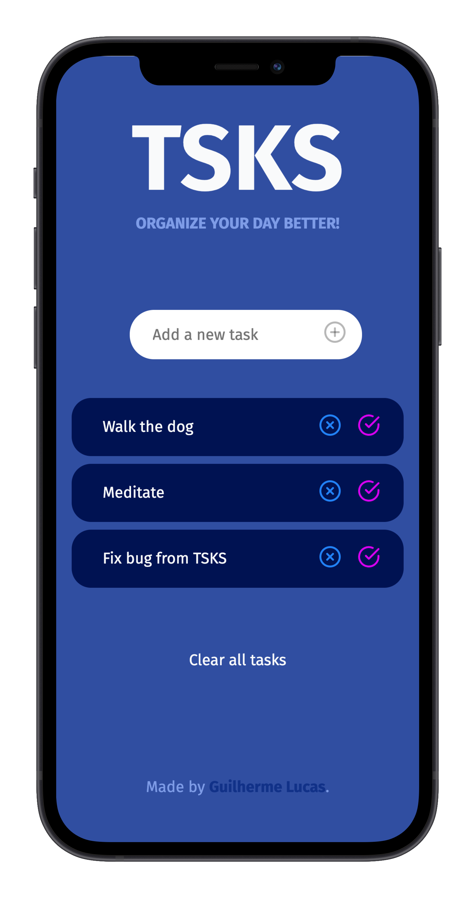
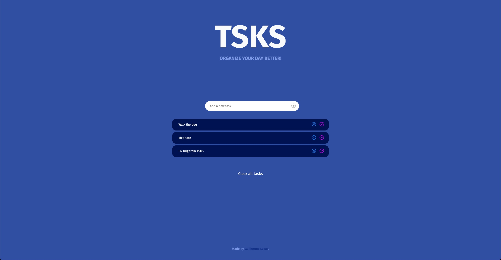
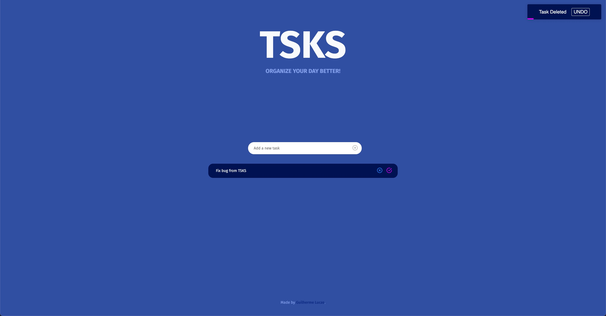

# TSKS

Track your daily tasks.



## Screenshots




## Tech Stack

**Client:**

- [React](https://github.com/facebook/react)
- [PostCSS](https://github.com/postcss/postcss)
- [React-Tostify](https://github.com/fkhadra/react-toastify)

## Features

- Mobile first design
- Add Tasks
- Completed Tasks
- Undo Delete
- Local Storage for saving tasks.

## Roadmap

- Create collections of lists

- Add component library for a11y with [Radix-UI](https://github.com/radix-ui/primitives)

- Add authentication and user accounts

- Add component animations with [React-Spring](https://github.com/pmndrs/react-spring)

## Lessons Learned

What did you learn while building this project? What challenges did you face and how did you overcome them?

- Reducer as State Management (Started with useState/setState)

## Optimizations

What optimizations did you make in your code? E.g. refactors, performance improvements, accessibility

- Refactored state management, from useState to useReducer and created my own reducer and dispatcher

<!--
## Usage/Examples

```javascript
import Component from 'my-project'

function App() {
  return <Component />
}
``` -->

## Acknowledgements

- [Color palette](https://dribbble.com/shots/14153121-ToDo-App-Dark-Theme/attachments/5779436?mode=media) created by [Alex Arutuynov](https://dribbble.com/alex_arutuynov/about)
